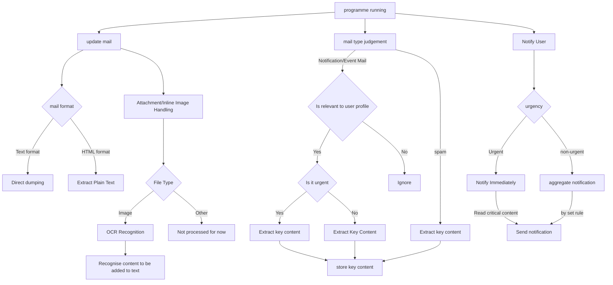

# Sum-Mail-Event

English | [中文](README_CN.md)

This project aims to filter emails using local LLM to extract only events/notification/urgent emails that are relevant to the user (custom portrait). 

Currently in the start-up phase.

TODO:
- [x] Mail reading section
- [x] OCR section
- [x] Message Body Processing section
- [ ] LLM Processing Mail section
    - [x] LLM event classification (judgement) module
    - [x] LLM Summary Module
    - [ ] LLM Text Extraction Module
- [ ] Sending Reminder section
- [ ] Complete the entire workflow

## Planned processing flow

- Run the main programme every so often:

    - Updates messages (pulls the latest X messages)

    - Preprocess messages
        - Full text: dump directly if it is text, extract plain text if it is HTML.
        - Attachments and embedded images:
            - For images, add the recognised content to the dumped text after OCR.
            - For other documents, it will not be processed for the time being.

    - Determine the type of emails: notification emails/event emails/spam emails.

        - Notification mail/event mail:
            - Whether it is related to user-defined image
                - Related:
                    - Determine whether the email is urgent (need to reply/know in time).
                - Extract key contents of emails and store them locally
        - Spam:
            - Extracts the key content of the email and stores it locally (to prevent LLM from misjudging it, so it will still appear in the summary)

    - Notify users
        - Tentatively, this will be in the form of an email to a customised email address.
        - If the email is urgent, the key content of the email will be read and notified immediately.
        - If it is not urgent, it will be notified every X emails/period of time.