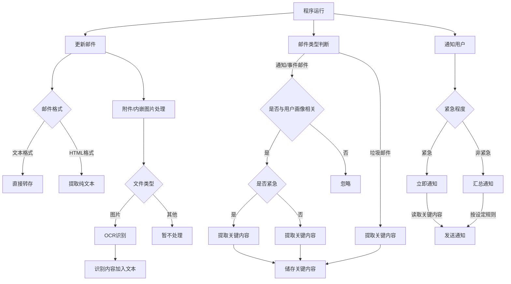

# Sum-Mail-Event

这个项目旨在利用本地LLM对邮件进行过滤，仅提取出与用户(自定义画像)有关的事件/通知/紧急邮件。

目前正在起步阶段

TODO:
- [x] 邮件读取部分
- [x] OCR部分
- [x] 邮件正文处理部分
- [ ] LLM处理邮件部分
    - [x] LLM事件分类(判断)模块
    - [x] LLM总结模块
    - [ ] LLM提取文本模块
- [ ] 发件提醒部分
- [ ] 完成整个工作流程

## 规划的处理流程

- 每一段时间运行一次主程序：

    - 更新邮件(拉取最新的X条邮件)

    - 对邮件进行预处理
        - 正文：如为文本直接转存，如为HTML提取纯文本
        - 附件以及内嵌图片：
            - 对于图片，进行OCR后将识别内容加至转存后的文本
            - 对于其他文件暂不处理

    - 判断邮件属于的类型：通知邮件/事件邮件/垃圾邮件

        - 通知邮件/事件邮件：
            - 是否与用户自定义画像有关
                - 有关：
                    - 判断是否紧急(需要及时回复/知晓)
                - 提取邮件关键内容并储存到本地
        - 垃圾邮件：
            - 提取邮件关键内容并储存到本地(为了防止LLM误判，因此依然会出现在总结中)

    - 通知用户
        - 形式暂定为发送邮件到自定义邮箱
        - 如为紧急类型的邮件则立即读取邮件关键内容并通知
        - 如非紧急类型，则每X条邮件/每一段时间汇总通知
